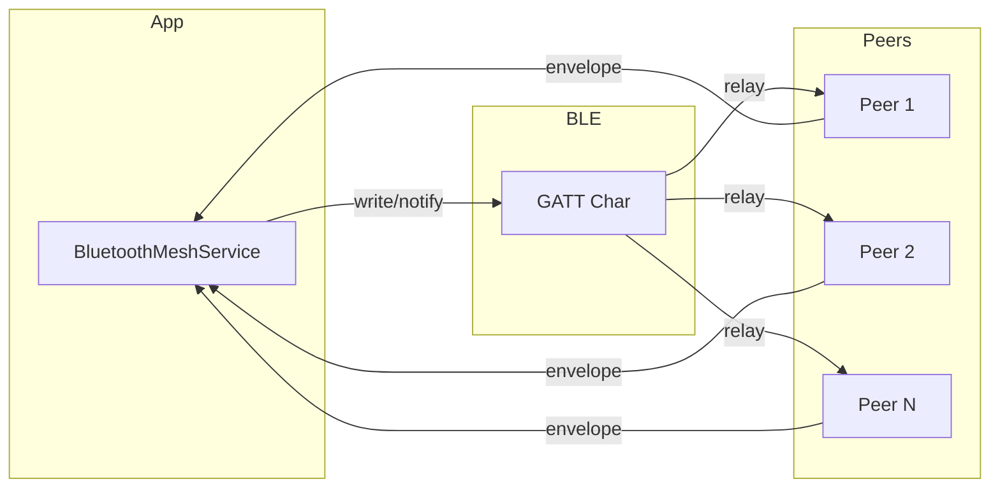
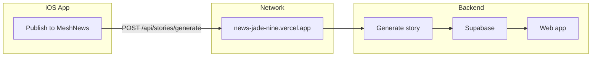

# MeshChat MVP — Features and Architecture

This document describes the main features, tech stack, and architecture of the MeshChat MVP: BLE mesh networking, encrypted messaging, image transfer, alerts map, web of trust, news platform, SOS messaging, and supporting components.

---

## 1. BLE Networking

**Purpose:** Dual-role CoreBluetooth mesh: advertise and scan, connect, write and notify, TTL flood with deduplication so messages propagate across peers without central infrastructure.

**Key files:** [BluetoothMeshService.swift](../MeshChatMVP/BluetoothMeshService.swift), [MeshEnvelope.swift](../MeshChatMVP/MeshEnvelope.swift), [MessageType.swift](../MeshChatMVP/MessageType.swift).

- **GATT:** Single service UUID `6E400001-B5A3-F393-E0A9-E50E24DCCA9E`, single characteristic `6E400002-B5A3-F393-E0A9-E50E24DCCA9E`. Centrals write to the characteristic (central → peripheral); peripheral notifies subscribed centrals (peripheral → centrals). All mesh traffic flows through this one characteristic.
- **Envelope:** Each message is a `MeshEnvelope`: `id` (UUID), `type` (MessageType), `senderID`, `senderName`, `timestamp`, `ttl`, `payload` (opaque Data). Optional `senderLatitude` / `senderLongitude` for distance inference when the sender opts in. JSON-encoded; max 512 bytes per envelope.
- **Dual role:** `BluetoothMeshService` uses both `CBPeripheralManager` (advertise + GATT server) and `CBCentralManager` (scan + connect + GATT client). Every device is both advertiser and scanner.
- **Relay:** On receive, if `ttl > 1`, the node decrements TTL (with jitter), then rebroadcasts the envelope to all connected peers except the immediate source (`excludeCentral` / `excludePeripheral`). Envelopes are dropped when TTL reaches 0 or when they exceed the size limit.
- **Deduplication:** In-memory bounded set + queue of seen envelope `id`s (e.g. 500 entries). Duplicates are dropped so the same envelope is not processed or relayed twice.
- **Scan windows:** Battery-friendly periodic scan: scan ON (default 12 s), then OFF (default 40 s). Configurable `scanWindowSeconds` / `scanIdleSeconds`. "Scan now" forces a window. Auto-connect runs when a peer is discovered during a scan window; optional auto-reconnect on dropped links.
- **State:** `DiscoveredPeer` (id, name, rssi, nickname, linkState, publicKey, lastSeen) drives the UI; `broadcastEnvelope` / `broadcastEnvelopeToCentrals` send to connected remotes and subscribed centrals.

---

## 2. Encrypted Messaging

**Purpose:** End-to-end encrypted direct messages between two devices using X25519 ECDH and AES-GCM; identity is established via a Curve25519 signing key (deviceID).

**Key files:** [ChatCrypto.swift](../MeshChatMVP/ChatCrypto.swift), [KeyManager.swift](../MeshChatMVP/KeyManager.swift), [AnnouncementPayload.swift](../MeshChatMVP/AnnouncementPayload.swift), [ChatPayload.swift](../MeshChatMVP/ChatPayload.swift).

- **Identity:** Curve25519 signing keypair stored in Keychain; public key is encoded as URL-safe base64 (no padding) and used as stable `deviceID` (`KeyManager.publicKeyBase64DeviceID`). This is the canonical peer identifier on the mesh.
- **Announce:** Every device sends `.announce` envelopes with `AnnouncementPayload`: `nickname`, `publicKeyBase64` (signing / identity), and `encryptionPublicKeyBase64` (X25519 for DMs). Peers learn each other’s encryption public key from these announces.
- **Crypto:** X25519 ECDH with peer’s encryption public key → shared secret → HKDF-SHA256 (salt `MeshChatMVP-DM-v1`, info `dm`, 32-byte output) → symmetric key. AES-GCM with 12-byte nonce; AAD = `senderID|recipientID|timestampMs` (big-endian). Ciphertext format: nonce(12) || ciphertext || tag(16), then base64 for the wire.
- **Wire format:** `ChatPayload` has `text`, optional `recipientID` (for DMs), and when encrypted: `encrypted == true`, `ciphertextB64` holds the sealed payload; `text` is ignored. The mesh still floods the envelope for relay; only the intended recipient can decrypt.
- **Flow:** When sending to a saved contact whose encryption key is known, the app seals the message and sets `encrypted`/`ciphertextB64`. When receiving, if `encrypted` is true and the sender’s encryption key is in `encryptionPublicKeyByDeviceID`, the app opens the ciphertext; otherwise it shows plaintext or fallback.

---

## 3. Image Transfer

**Purpose:** Send images over the mesh by chunking JPEG data to fit the 512-byte envelope limit; map label thumbnails use a separate message type so chat images and map thumbnails are distinct.

**Key files:** [ImageChunkPayload.swift](../MeshChatMVP/ImageChunkPayload.swift), [MeshImageUtils.swift](../MeshChatMVP/MeshImageUtils.swift), [MessageType.swift](../MeshChatMVP/MessageType.swift) (`.imageChunk`, `.mapLabelImageChunk`).

- **Chunk payload:** `ImageChunkPayload`: `transferId` (UUID, same for all chunks of one image), `chunkIndex`, `totalChunks`, `data` (raw bytes). Each chunk is sent in its own envelope.
- **Message types:** Chat images use `MessageType.imageChunk` (6). Map label thumbnails use `MessageType.mapLabelImageChunk` (9) so the receiver can reassemble and attach them to the correct label.
- **Processing:** `MeshImageUtils` scales the image (max dimension 320 pt), then JPEG-compresses with decreasing quality (down to ~0.28) until the result fits in `maxJPEGBytes` (12 KB). The resulting data is split into chunks that fit within the envelope payload limit. Reassembly on receive uses `transferId` and `chunkIndex`; when all chunks are present, the image is decoded and shown (or stored for map labels).

---

## 4. Alerts Map

**Purpose:** User-generated alerts and map labels (location + category) shared over the mesh; displayed on the map tab and in the alert feed, with optional thumbnails and configurable event types.

**Key files:** [AlertPayload.swift](../MeshChatMVP/AlertPayload.swift), [Alert.swift](../MeshChatMVP/Alert.swift), [MapLabelModels.swift](../MeshChatMVP/MapLabelModels.swift), [MapTabView.swift](../MeshChatMVP/MapTabView.swift), [AlertFeedView.swift](../MeshChatMVP/AlertFeedView.swift), [EventTypesConfig.swift](../MeshChatMVP/EventTypesConfig.swift).

- **Alerts:** `AlertPayload` / `Alert`: `alertID`, type (hazard / aid / other), severity, lat/lon, description, createdAt, expiresAt. Stored in the `alerts` table; propagated as `.alert` envelopes. Alerts have a default expiry per type (e.g. 6 h hazard, 24 h aid).
- **Map labels:** `MapLabelPayload`: id, category (hazard, help, other plus legacy categories such as armedConflict, explosion, drone), lat/lon, senderID, senderName, timestamp, optional customLabelName, customDescription, customSystemImage. Short JSON keys (e.g. `i`, `c`, `a`, `o`) to stay under 512 bytes. Sent as `.mapLabel` envelopes. A cooldown (e.g. 30 s) limits how often a user can post a new map label.
- **Map UI:** Map shows transmitters (peers) and label clusters; thumbnails come from `.mapLabelImageChunk` and are cached by label id. The first three categories (hazard, help, other) are configurable via `EventTypesConfig` (name/description), persisted in `event_types_config.json` in Application Support.

---

## 5. Web of Trust

**Purpose:** Trust scoring for alerts and map labels using vouches (confirm/deny), relationship (friend/associate/stranger), and proximity (GPS/RSSI), with time decay and clustering.

**Key files:** [AlertTrustEngine.swift](../MeshChatMVP/AlertTrustEngine.swift), [VouchPayload.swift](../MeshChatMVP/VouchPayload.swift), [Vouch.swift](../MeshChatMVP/Vouch.swift), [NodeSighting.swift](../MeshChatMVP/NodeSighting.swift), [DatabaseManager.swift](../MeshChatMVP/DatabaseManager.swift).

- **Vouches:** A `.vouch` envelope carries `VouchPayload`: `alertID`, `value` (1 = confirm, -1 = deny). One vouch per (alert, voucher); stored in the `vouches` table with composite primary key (alertID, voucherID).
- **Scoring formula:**  
  `(W_author·R_author + Σ(W_vouch·R_i·P_i) − Σ(W_deny·R_j·P_j)) · e^(-λΔt)`  
  Weights: author (e.g. 10), vouch (5), deny (10). R = relationship multiplier (friend 1.0, associate 0.5, stranger 0.2). P = proximity multiplier (close/far by GPS threshold ~500 m or RSSI ~-70). Time decay uses λ such that half-life is ~2 hours. Own alerts get friend-level R.
- **Clustering:** Alerts (and similarly map labels) are grouped by distance (e.g. 500 m) and time window (e.g. 15 min). Clusters are sorted by aggregate score; the lead alert/label per cluster is used for display. Relationships come from `SavedContact.relationship`; proximity from `NodeSighting` (nodeID, lat, lon, timestamp, rssi).

---

## 6. News Platform

**Purpose:** Publish mesh-derived content (map labels, thumbnails, and an SOS anchor) to an external API that generates a story and stores it (e.g. in Supabase) for consumption by a web app.

**Key files:** [MeshNewsPublish.swift](../MeshChatMVP/MeshNewsPublish.swift), [ContentView.swift](../MeshChatMVP/ContentView.swift) (You tab), [WiFiMonitor.swift](../MeshChatMVP/WiFiMonitor.swift).

- **API:** POST `https://news-jade-nine.vercel.app/api/stories/generate` with JSON body: `news_id`, `sos` (title, description, latitude, longitude), `events[]` (each: title, description, latitude, longitude, optional image as base64 + mime_type). The API requires both `news_id` and `sos` to create a story.
- **Client:** `publishMapDataToMeshNews(mapLabels, thumbnails, userLocation)` builds `events` from current map labels and thumbnails; SOS is built from user location, or the first event’s location, or a placeholder. “Publish to MeshNews” is shown in the You tab only when the device is on WiFi (via `NWPathMonitor` in `WiFiMonitor`).

---

## 7. SOS Messaging

**Purpose:** In this codebase, SOS is primarily the **incident anchor** for the News API (the required `sos` object); optional authority/SMS notification is handled by the backend, not the app.

- **In-app:** There is no dedicated SOS message type on the mesh. Map “Help” labels and alert types (e.g. aid) act as community distress or support signals. When the user publishes to MeshNews, their current location (or first event location) is sent as the SOS location so the story has a clear incident anchor.
- **Backend (external):** The News API may support options such as `send_sos_sms` (e.g. Twilio) to notify authorities. SOS semantics (title, description, lat/lon) are defined by the News API; in-app SOS is effectively “location + map export” when publishing.

---

## 8. Tech Stack and Architecture

- **iOS app:** Swift, SwiftUI; CoreBluetooth (BLE); CryptoKit (X25519, AES-GCM, HKDF-SHA256); Security (Keychain); GRDB (SQLite); CoreLocation; UserNotifications; Network framework (NWPathMonitor for WiFi detection).
- **Persistence:** SQLite via GRDB. Tables: `contacts`, `messages`, `alerts`, `vouches`, `nodeSightings`, `saved_contacts`. Migrations and CRUD live in [DatabaseManager.swift](../MeshChatMVP/DatabaseManager.swift).
- **Identity and contacts:** [DeviceIdentity.swift](../MeshChatMVP/DeviceIdentity.swift) holds deviceID (from KeyManager), nickname, and shareLocation (UserDefaults). [SavedContact](../MeshChatMVP/DatabaseManager.swift) stores publicKey, nickname, relationship (friend/associate). Contact activity (last message preview, unread count) is in memory and persisted under `meshchat.contactActivity.v1`.

---

## 9. Other Important Components

- **DeviceIdentity:** deviceID (KeyManager’s public key base64), nickname, shareLocation; loaded/saved via UserDefaults.
- **KeyManager:** Signing keypair in Keychain (deviceID); separate X25519 encryption keypair for DMs (Keychain account `encryption-x25519`). Exposes base64 device ID and fingerprint helper for UI.
- **DatabaseManager:** Single GRDB `DatabaseQueue`, migrations for schema versions, CRUD for contacts, messages, alerts, vouches, nodeSightings, saved_contacts. Prunes old DM messages by TTL (e.g. 20 minutes).
- **Contact activity:** Last text and unread count per saved contact (by peer deviceID); `markContactThreadRead`, `recordContactInbound` / `recordContactOutboundDM`; drives Chat and Contacts list previews.
- **ChatMessage / PersistedMessage:** Model and DB representation for chat messages (broadcast vs DM channel, sender, text, timestamp, optional image); DM messages are pruned after `dmDataTTLSeconds`.
